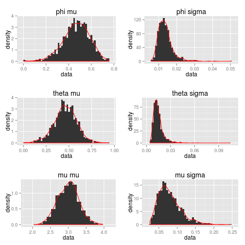
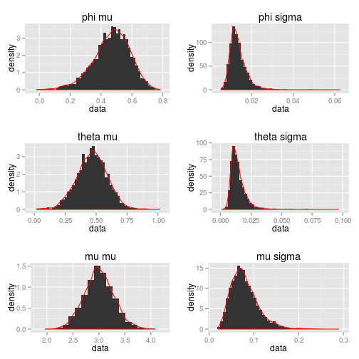

% Assignment #3
% Robert Smith
% \today


1. Consider an ARMA(1,1) model with $\phi=0.5$ and $\theta=-0.45$ with $\mu=3$ 
  and $\sim N(0,1)$ errors.


```r

library(TSA)
library(xtable)
library(ggplot2)
library(gridExtra)

ARMA11 <- function(n, phi, theta) {
  # modify theta for Cryer definition
  theta <- theta * -1 
  return(
    data.frame(
      var_phi = ((1 - phi**2) / n) * (((1 - phi * theta) / (phi - theta))**2),
      var_theta = ((1 - theta**2) / n) * (((1 - phi * theta) / (phi - theta))**2),
      corr = sqrt((1 - phi**2) * (1 - theta**2)) / (1 - phi * theta)
    ))
}

print(
  xtable(
    ARMA11(n = 100, phi = 0.5, theta = -0.45), 
    digits = 6, 
    caption = "Question 1-a"
  ), type = "latex", 
  caption.placement = "top")
```

\begin{table}[ht]
\centering
\caption{Question 1-a} 
\begin{tabular}{rrrr}
  \hline
 & var\_phi & var\_theta & corr \\ 
  \hline
1 & 1.801875 & 1.915994 & 0.997917 \\ 
   \hline
\end{tabular}
\end{table}

```r

print(
  xtable(
    ARMA11(n = 300, phi = 0.5, theta = -0.45), 
    digits = 6, 
    caption = "Question 1-b"
  ), type = "latex", 
  caption.placement = "top")
```

\begin{table}[ht]
\centering
\caption{Question 1-b} 
\begin{tabular}{rrrr}
  \hline
 & var\_phi & var\_theta & corr \\ 
  \hline
1 & 0.600625 & 0.638665 & 0.997917 \\ 
   \hline
\end{tabular}
\end{table}

```r

ARIMA.MC <- function(reps, sample.size, phi, theta, mean, err = list(mean = 0, sd = 1)) {   
  # correcting to Cryer theta notation
  theta <- theta * -1
  # chained output initializers
  mle <- vars <- matrix(0, ncol = 3, nrow = reps)

  for (i in 1:reps) {
    sim <- arima.sim(
      n = sample.size,
      list(ar = phi, ma = theta),
      innov = rnorm(sample.size, err$mean, err$sd)
    ) + mean

    est <- arima(sim, order = c(1, 0, 1))
    mle[i,] <- est$coef  
    vars[i,] <- diag(est$var.coef)
  }

  return(as.data.frame(cbind(mle,vars)))
}

Q1C.100 <- ARIMA.MC(reps = 1000, sample.size = 100, phi = 0.5, theta = -0.45, 
                    mean = 3, err = list(mean = 0, sd = 1) )

MLE <- as.data.frame(Q1C.100[,1])
VARS <- as.data.frame(Q1C.100[,4])
names(MLE) <- names(VARS) <- "data"

plot1 <- ggplot(MLE, aes(x = data, y = ..density..)) +    
  geom_histogram(binwidth = sum(abs(range(MLE$data)))/50 ) +    
  geom_density(color = "red", fill = NA) +
  ggtitle(paste(expression(phi), expression(mu)))

plot2 <- ggplot(VARS, aes(x = data, y = ..density..)) +    
  geom_histogram(binwidth = sum(abs(range(VARS$data)))/50 ) +    
  geom_density(color = "red", fill = NA) + 
  ggtitle(paste(expression(phi), expression(sigma)))

MLE <- as.numeric(MLE[[1]]); VARS <- as.numeric(VARS[[1]])
print(
  xtable(
    data.frame(
      phi.mean = mean(MLE),
      phi.sd = sd(MLE),
      phi.err.mean = sqrt(mean(VARS))
      ), digits = 6
    ), type = "latex"
  )
```

\begin{table}[ht]
\centering
\begin{tabular}{rrrr}
  \hline
 & phi.mean & phi.sd & phi.err.mean \\ 
  \hline
1 & 0.468353 & 0.116474 & 0.116200 \\ 
   \hline
\end{tabular}
\end{table}

```r

MLE <- as.data.frame(Q1C.100[,2])
VARS <- as.data.frame(Q1C.100[,5])
names(MLE) <- names(VARS) <- "data"

plot3 <- ggplot(MLE, aes(x = data, y = ..density..)) +    
  geom_histogram(binwidth = sum(abs(range(MLE$data)))/50 ) +    
  geom_density(color = "red", fill = NA) +
  ggtitle(paste(expression(theta), expression(mu)))

plot4 <- ggplot(VARS, aes(x = data, y = ..density..)) +    
  geom_histogram(binwidth = sum(abs(range(VARS$data)))/50 ) +    
  geom_density(color = "red", fill = NA) + 
  ggtitle(paste(expression(theta), expression(sigma)))

MLE <- as.numeric(MLE[[1]]); VARS <- as.numeric(VARS[[1]])
print(
  xtable(
    data.frame(
      theta.mean = mean(MLE),
      theta.sd = sd(MLE),
      theta.err.mean = mean(VARS)
      ), digits = 6
    ), type = "latex"
  )
```

\begin{table}[ht]
\centering
\begin{tabular}{rrrr}
  \hline
 & theta.mean & theta.sd & theta.err.mean \\ 
  \hline
1 & 0.468788 & 0.124102 & 0.014154 \\ 
   \hline
\end{tabular}
\end{table}

```r

MLE <- as.data.frame(Q1C.100[,3])
VARS <- as.data.frame(Q1C.100[,6])
names(MLE) <- names(VARS) <- "data"

plot5 <- ggplot(MLE, aes(x = data, y = ..density..)) +    
  geom_histogram(binwidth = sum(abs(range(MLE$data)))/50 ) +    
  geom_density(color = "red", fill = NA) +
  ggtitle(paste(expression(mu), expression(mu)))

plot6 <- ggplot(VARS, aes(x = data, y = ..density..)) +    
  geom_histogram(binwidth = sum(abs(range(VARS$data)))/50 ) +    
  geom_density(color = "red", fill = NA) + 
  ggtitle(paste(expression(mu), expression(sigma)))

MLE <- as.numeric(MLE[[1]]); VARS <- as.numeric(VARS[[1]])
print(
  xtable(
    data.frame(
      mean.mean = mean(MLE),
      mean.sd = sd(MLE),
      mean.err.mean = mean(VARS)
      ), digits = 6
    ), type = "latex"
  )
```

\begin{table}[ht]
\centering
\begin{tabular}{rrrr}
  \hline
 & mean.mean & mean.sd & mean.err.mean \\ 
  \hline
1 & 3.004916 & 0.285230 & 0.080186 \\ 
   \hline
\end{tabular}
\end{table}

```r

grid.arrange(plot1, plot2, plot3, plot4, plot5, plot6, ncol=2)
```

```
Warning: position_stack requires constant width: output may be incorrect
```

 

```r


Q1C.300 <- ARIMA.MC(reps = 1000, sample.size = 300, phi = 0.5, theta = -0.45, 
                    mean = 3, err = list(mean = 0, sd = 1) )
```


```r
MLE <- as.data.frame(Q1C.300[,1])
VARS <- as.data.frame(Q1C.300[,4])
names(MLE) <- names(VARS) <- "data"

plot1 <- ggplot(MLE, aes(x = data, y = ..density..)) +    
  geom_histogram(binwidth = sum(abs(range(MLE$data)))/50 ) +    
  geom_density(color = "red", fill = NA) +
  ggtitle(paste(expression(phi), expression(mu)))

plot2 <- ggplot(VARS, aes(x = data, y = ..density..)) +    
  geom_histogram(binwidth = sum(abs(range(VARS$data)))/50 ) +    
  geom_density(color = "red", fill = NA) + 
  ggtitle(paste(expression(phi), expression(sigma)))

MLE <- as.numeric(MLE[[1]]); VARS <- as.numeric(VARS[[1]])
print(
  xtable(
    data.frame(
      phi.mean = mean(MLE),
      phi.sd = sd(MLE),
      phi.err.mean = sqrt(mean(VARS))
      ), digits = 6
    ), type = "latex"
  )
```

\begin{table}[ht]
\centering
\begin{tabular}{rrrr}
  \hline
 & phi.mean & phi.sd & phi.err.mean \\ 
  \hline
1 & 0.488480 & 0.068250 & 0.065454 \\ 
   \hline
\end{tabular}
\end{table}

```r

MLE <- as.data.frame(Q1C.300[,2])
VARS <- as.data.frame(Q1C.300[,5])
names(MLE) <- names(VARS) <- "data"

plot3 <- ggplot(MLE, aes(x = data, y = ..density..)) +    
  geom_histogram(binwidth = sum(abs(range(MLE$data)))/50 ) +    
  geom_density(color = "red", fill = NA) +
  ggtitle(paste(expression(theta), expression(mu)))

plot4 <- ggplot(VARS, aes(x = data, y = ..density..)) +    
  geom_histogram(binwidth = sum(abs(range(VARS$data)))/50 ) +    
  geom_density(color = "red", fill = NA) + 
  ggtitle(paste(expression(theta), expression(sigma)))

MLE <- as.numeric(MLE[[1]]); VARS <- as.numeric(VARS[[1]])
print(
  xtable(
    data.frame(
      theta.mean = mean(MLE),
      theta.sd = sd(MLE),
      theta.err.mean = mean(VARS)
      ), digits = 6
    ), type = "latex"
  )
```

\begin{table}[ht]
\centering
\begin{tabular}{rrrr}
  \hline
 & theta.mean & theta.sd & theta.err.mean \\ 
  \hline
1 & 0.454661 & 0.070568 & 0.004526 \\ 
   \hline
\end{tabular}
\end{table}

```r

MLE <- as.data.frame(Q1C.300[,3])
VARS <- as.data.frame(Q1C.300[,6])
names(MLE) <- names(VARS) <- "data"

plot5 <- ggplot(MLE, aes(x = data, y = ..density..)) +    
  geom_histogram(binwidth = sum(abs(range(MLE$data)))/50 ) +    
  geom_density(color = "red", fill = NA) +
  ggtitle(paste(expression(mu), expression(mu)))

plot6 <- ggplot(VARS, aes(x = data, y = ..density..)) +    
  geom_histogram(binwidth = sum(abs(range(VARS$data)))/50 ) +    
  geom_density(color = "red", fill = NA) + 
  ggtitle(paste(expression(mu), expression(sigma)))

MLE <- as.numeric(MLE[[1]]); VARS <- as.numeric(VARS[[1]])
print(
  xtable(
    data.frame(
      mean.mean = mean(MLE),
      mean.sd = sd(MLE),
      mean.err.mean = mean(VARS)
      ), digits = 6
    ), type = "latex"
  )
```

\begin{table}[ht]
\centering
\begin{tabular}{rrrr}
  \hline
 & mean.mean & mean.sd & mean.err.mean \\ 
  \hline
1 & 3.000948 & 0.163556 & 0.027519 \\ 
   \hline
\end{tabular}
\end{table}

```r

grid.arrange(plot1, plot2, plot3, plot4, plot5, plot6, ncol=2)
```

 

```r

```


The monte carlo simuation indicates that $\phi \approx 0.5$  and $\theta \approx 0.5$, but $\sigma_{\phi} > \sigma_{\theta}$

The simulation indicates that as N approaches infinity that the MLE will converge towards the theoretical value.

2. Consider an ARMA(1,1) with $\phi = 0.5$ and $\theta = 0.45$ with $\mu=3$ and $\sim N(0,1)$ errors.


```r

print(
  xtable(
    ARMA11(n = 1000, phi = 0.5, theta = 0.45), 
    digits = 6, 
    caption = "Question 1-a"
  ), type = "latex", 
  caption.placement = "top")
```

\begin{table}[ht]
\centering
\caption{Question 1-a} 
\begin{tabular}{rrrr}
  \hline
 & var\_phi & var\_theta & corr \\ 
  \hline
1 & 0.001247 & 0.001326 & 0.631335 \\ 
   \hline
\end{tabular}
\end{table}

```r

print(
  xtable(
    ARMA11(n = 3000, phi = 0.5, theta = 0.45), 
    digits = 6, 
    caption = "Question 1-b"
  ), type = "latex", 
  caption.placement = "top")
```

\begin{table}[ht]
\centering
\caption{Question 1-b} 
\begin{tabular}{rrrr}
  \hline
 & var\_phi & var\_theta & corr \\ 
  \hline
1 & 0.000416 & 0.000442 & 0.631335 \\ 
   \hline
\end{tabular}
\end{table}

```r

# 1000 reps - Monte Carlo
Q2C.1000 <- ARIMA.MC(reps = 1000, sample.size = 100, phi = 0.5, theta = -0.45, 
                    mean = 3, err = list(mean = 0, sd = 1) )

MLE <- as.data.frame(Q2C.1000[,1])
VARS <- as.data.frame(Q2C.1000[,4])
names(MLE) <- names(VARS) <- "data"

plot1 <- ggplot(MLE, aes(x = data, y = ..density..)) +    
  geom_histogram(binwidth = sum(abs(range(MLE$data)))/50 ) +    
  geom_density(color = "red", fill = NA) +
  ggtitle(paste(expression(phi), expression(mu)))

plot2 <- ggplot(VARS, aes(x = data, y = ..density..)) +    
  geom_histogram(binwidth = sum(abs(range(VARS$data)))/50 ) +    
  geom_density(color = "red", fill = NA) + 
  ggtitle(paste(expression(phi), expression(sigma)))

MLE <- as.numeric(MLE[[1]]); VARS <- as.numeric(VARS[[1]])
print(
  xtable(
    data.frame(
      phi.mean = mean(MLE),
      phi.sd = sd(MLE),
      phi.err.mean = sqrt(mean(VARS))
      ), digits = 6
    ), type = "latex"
  )
```

\begin{table}[ht]
\centering
\begin{tabular}{rrrr}
  \hline
 & phi.mean & phi.sd & phi.err.mean \\ 
  \hline
1 & 0.465387 & 0.121720 & 0.116419 \\ 
   \hline
\end{tabular}
\end{table}

```r

MLE <- as.data.frame(Q2C.1000[,2])
VARS <- as.data.frame(Q2C.1000[,5])
names(MLE) <- names(VARS) <- "data"

plot3 <- ggplot(MLE, aes(x = data, y = ..density..)) +    
  geom_histogram(binwidth = sum(abs(range(MLE$data)))/50 ) +    
  geom_density(color = "red", fill = NA) +
  ggtitle(paste(expression(theta), expression(mu)))

plot4 <- ggplot(VARS, aes(x = data, y = ..density..)) +    
  geom_histogram(binwidth = sum(abs(range(VARS$data)))/50 ) +    
  geom_density(color = "red", fill = NA) + 
  ggtitle(paste(expression(theta), expression(sigma)))

MLE <- as.numeric(MLE[[1]]); VARS <- as.numeric(VARS[[1]])
print(
  xtable(
    data.frame(
      theta.mean = mean(MLE),
      theta.sd = sd(MLE),
      theta.err.mean = mean(VARS)
      ), digits = 6
    ), type = "latex"
  )
```

\begin{table}[ht]
\centering
\begin{tabular}{rrrr}
  \hline
 & theta.mean & theta.sd & theta.err.mean \\ 
  \hline
1 & 0.469115 & 0.124380 & 0.014054 \\ 
   \hline
\end{tabular}
\end{table}

```r

MLE <- as.data.frame(Q2C.1000[,3])
VARS <- as.data.frame(Q2C.1000[,6])
names(MLE) <- names(VARS) <- "data"

plot5 <- ggplot(MLE, aes(x = data, y = ..density..)) +    
  geom_histogram(binwidth = sum(abs(range(MLE$data)))/50 ) +    
  geom_density(color = "red", fill = NA) +
  ggtitle(paste(expression(mu), expression(mu)))

plot6 <- ggplot(VARS, aes(x = data, y = ..density..)) +    
  geom_histogram(binwidth = sum(abs(range(VARS$data)))/50 ) +    
  geom_density(color = "red", fill = NA) + 
  ggtitle(paste(expression(mu), expression(sigma)))

MLE <- as.numeric(MLE[[1]]); VARS <- as.numeric(VARS[[1]])
print(
  xtable(
    data.frame(
      mean.mean = mean(MLE),
      mean.sd = sd(MLE),
      mean.err.mean = mean(VARS)
      ), digits = 6
    ), type = "latex"
  )
```

\begin{table}[ht]
\centering
\begin{tabular}{rrrr}
  \hline
 & mean.mean & mean.sd & mean.err.mean \\ 
  \hline
1 & 2.988990 & 0.294159 & 0.079409 \\ 
   \hline
\end{tabular}
\end{table}

```r

grid.arrange(plot1, plot2, plot3, plot4, plot5, plot6, ncol=2)
```

 


```r

## 3000 reps - Monte Carlo
Q2C.3000 <- ARIMA.MC(reps = 3000, sample.size = 100, phi = 0.5, theta = -0.45, 
                    mean = 3, err = list(mean = 0, sd = 1) )

MLE <- as.data.frame(Q2C.3000[,1])
VARS <- as.data.frame(Q2C.3000[,4])
names(MLE) <- names(VARS) <- "data"

plot1 <- ggplot(MLE, aes(x = data, y = ..density..)) +    
  geom_histogram(binwidth = sum(abs(range(MLE$data)))/50 ) +    
  geom_density(color = "red", fill = NA) +
  ggtitle(paste(expression(phi), expression(mu)))

plot2 <- ggplot(VARS, aes(x = data, y = ..density..)) +    
  geom_histogram(binwidth = sum(abs(range(VARS$data)))/50 ) +    
  geom_density(color = "red", fill = NA) + 
  ggtitle(paste(expression(phi), expression(sigma)))

MLE <- as.numeric(MLE[[1]]); VARS <- as.numeric(VARS[[1]])
print(
  xtable(
    data.frame(
      phi.mean = mean(MLE),
      phi.sd = sd(MLE),
      phi.err.mean = sqrt(mean(VARS))
      ), digits = 6
    ), type = "latex"
  )
```

\begin{table}[ht]
\centering
\begin{tabular}{rrrr}
  \hline
 & phi.mean & phi.sd & phi.err.mean \\ 
  \hline
1 & 0.466501 & 0.117781 & 0.116903 \\ 
   \hline
\end{tabular}
\end{table}

```r

MLE <- as.data.frame(Q2C.3000[,2])
VARS <- as.data.frame(Q2C.3000[,5])
names(MLE) <- names(VARS) <- "data"

plot3 <- ggplot(MLE, aes(x = data, y = ..density..)) +    
  geom_histogram(binwidth = sum(abs(range(MLE$data)))/50 ) +    
  geom_density(color = "red", fill = NA) +
  ggtitle(paste(expression(theta), expression(mu)))

plot4 <- ggplot(VARS, aes(x = data, y = ..density..)) +    
  geom_histogram(binwidth = sum(abs(range(VARS$data)))/50 ) +    
  geom_density(color = "red", fill = NA) + 
  ggtitle(paste(expression(theta), expression(sigma)))

MLE <- as.numeric(MLE[[1]]); VARS <- as.numeric(VARS[[1]])
print(
  xtable(
    data.frame(
      theta.mean = mean(MLE),
      theta.sd = sd(MLE),
      theta.err.mean = mean(VARS)
      ), digits = 6
    ), type = "latex"
  )
```

\begin{table}[ht]
\centering
\begin{tabular}{rrrr}
  \hline
 & theta.mean & theta.sd & theta.err.mean \\ 
  \hline
1 & 0.466570 & 0.119078 & 0.014295 \\ 
   \hline
\end{tabular}
\end{table}

```r

MLE <- as.data.frame(Q2C.3000[,3])
VARS <- as.data.frame(Q2C.3000[,6])
names(MLE) <- names(VARS) <- "data"

plot5 <- ggplot(MLE, aes(x = data, y = ..density..)) +    
  geom_histogram(binwidth = sum(abs(range(MLE$data)))/50 ) +    
  geom_density(color = "red", fill = NA) +
  ggtitle(paste(expression(mu), expression(mu)))

plot6 <- ggplot(VARS, aes(x = data, y = ..density..)) +    
  geom_histogram(binwidth = sum(abs(range(VARS$data)))/50 ) +    
  geom_density(color = "red", fill = NA) + 
  ggtitle(paste(expression(mu), expression(sigma)))

MLE <- as.numeric(MLE[[1]]); VARS <- as.numeric(VARS[[1]])
print(
  xtable(
    data.frame(
      mean.mean = mean(MLE),
      mean.sd = sd(MLE),
      mean.err.mean = mean(VARS)
      ), digits = 6
    ), type = "latex"
  )
```

\begin{table}[ht]
\centering
\begin{tabular}{rrrr}
  \hline
 & mean.mean & mean.sd & mean.err.mean \\ 
  \hline
1 & 3.007895 & 0.283936 & 0.079979 \\ 
   \hline
\end{tabular}
\end{table}

```r

grid.arrange(plot1, plot2, plot3, plot4, plot5, plot6, ncol=2)
```

 


Given the samples with $n = 1000$ and $n = 3000$ Monte Carlo simulation repetitions, we see that the mean values for $\hat{\phi}$ and $\hat{\theta}$ have essentially converged to their theoretical values. Also, when we compare these runs to the previous runs at $n = 1000$ and $n = 3000$ we can see that the error values appear closer to the theoretical distribution for $\chi^2$. 

As with before, as n approaches infinity for the Monte Carlo simulation, the simulation results become closer to the theoretical expected values.

3. Plot histogram of $\hat{\phi}$ and $\hat{\theta}$ from Problem 1 and for $n = 1000$, $n = 3000$ from problem 2. 

Please see plots included above.
